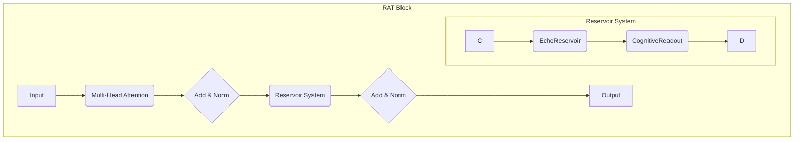

# DTE Reservoir-LLM Architecture

This document outlines the architecture for a novel transformer model that integrates a **Reservoir Computing** system directly into its structure. This hybrid model, the **Reservoir-Augmented Transformer (RAT)**, replaces standard feed-forward layers with trainable ESN readouts, enabling dynamic, stateful processing within the transformer block.

## 1. Core Concept: Reservoir as a Dynamic Feed-Forward Network

The key innovation is to treat an Echo State Network (ESN) as a replacement for the static, stateless feed-forward (FFN) layers in a traditional transformer.

- **Standard Transformer**: `Attention -> Add & Norm -> FFN -> Add & Norm`
- **Reservoir-Augmented Transformer**: `Attention -> Add & Norm -> ReservoirReadout -> Add & Norm`

| Component | Standard Transformer | Reservoir-Augmented Transformer |
|:---|:---|:---|
| **State** | Stateless | Stateful (Reservoir maintains a dynamic internal state) |
| **Temporal Processing** | Relies solely on positional embeddings | Inherently temporal; processes sequences naturally |
| **Training** | Fully backpropagation-based | Hybrid: backpropagation for attention, linear regression (or RLS) for reservoir readout |
| **Adaptability** | Static weights | Readout can be adapted online with efficient algorithms (RLS) |

## 2. Detailed Architecture: The RAT Block

A single RAT block consists of the following components:

1.  **Multi-Head Self-Attention**: Standard self-attention mechanism.
2.  **Reservoir System**: This is the core of the RAT.
    -   **`EchoReservoir`**: A fixed, non-linear, recurrent neural network that receives the output from the attention layer. It projects the input into a high-dimensional state space, creating a rich temporal representation.
    -   **`CognitiveReadout`**: A trainable linear layer (the "readout") that learns to map the reservoir's state to the desired output. This is the only part of the reservoir system that is trained via backpropagation.
3.  **Add & Norm**: Standard residual connection and layer normalization.

## 3. Training Workflow

The training process is a hybrid approach that leverages the strengths of both transformers and reservoir computing.

1.  **End-to-End Backpropagation**: The entire model, including the `CognitiveReadout` layers, is trained end-to-end using backpropagation. The `EchoReservoir` weights remain fixed.
2.  **Vocabulary and Tokenization**: A custom vocabulary is built using the `nanecho-custom-vocab` skill. This ensures that domain-specific terms are represented efficiently.
3.  **CI/CD Training Pipeline**: The `echo-train` skill's `netrain-cached.yml` workflow is adapted to handle the new RAT architecture. The training script is modified to accept a `--model-type RAT` flag.

## 4. Cognitive Integration (The DTE Pipeline)

The RAT is not just a standalone model; it is a core component of the Deep Tree Echo cognitive architecture.

-   **`echo-introspect`**: The reservoir's internal state provides a rich source of data for introspection. The dynamics of the reservoir can be analyzed to understand the model's internal 
'"cognitive state."'
-   **`unreal-echo` / `meta-echo-dna`**: The output of the RAT can be directly piped into the expression and animation systems, allowing the avatar's behavior to be driven by the model's stateful understanding of the conversation.
-   **`harmonic-llm`**: The principles of frequency-domain processing can be applied to the reservoir, creating a **Harmonic Reservoir** that operates on spectral representations of the input.

## 5. Deployment

Deployment follows the `echo-deploy` workflow. The `convert_to_huggingface.py` script is modified to handle the new RAT architecture, ensuring that the custom reservoir layers are correctly serialized and can be loaded by the standard HuggingFace `transformers` library.
