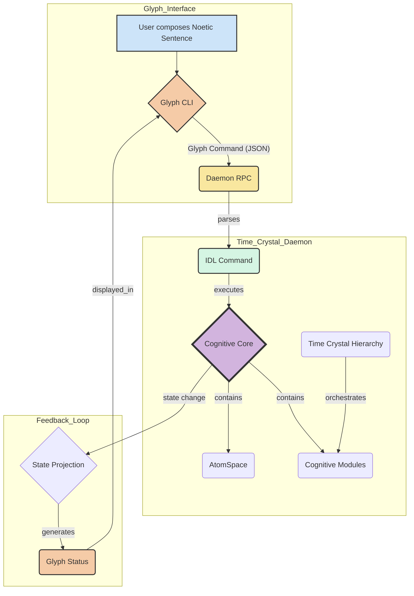

# Glyph-Noetic Engine: A Composed Architecture

This document details the architecture of the Glyph-Noetic Engine, synthesized from the composition:

> `/neuro-symbolic-engine ( /time-crystal-nn ( /time-crystal-neuron ) [ /time-crystal-daemon ] )`

## 1. The Foundational Layers: Time and Neural Implementation

The architecture is built upon a deterministic, temporally organized neural core.

| Layer | Skill | Function |
| :--- | :--- | :--- |
| **Temporal Hierarchy** | `/time-crystal-neuron` | Defines the nested, periodic time scales (9 levels for a neuron, 12 for a brain) that govern all processing. This is the fundamental rhythm of the engine. |
| **Neural Modules** | `/time-crystal-nn` | Provides the Torch7 `nn` modules (`nn4c`, `nn9c`) that implement cognitive functions. Each module is assigned to specific time crystal levels, ensuring its operations are synchronized with the global hierarchy. |
| **Deterministic Core** | `/time-crystal-daemon` | Executes the composed neural architecture as a deterministic, auditable daemon. It manages the AtomSpace, schedules module execution based on time crystal phases, and exposes a typed IDL for control. |

This core is a pure, self-contained cognitive engine. It processes information according to its temporal and neural structure, but it lacks a direct, symbolic way to be understood or manipulated.

## 2. The Meta-Cognitive Bridge: Neuro-Symbolic Fusion

The `/neuro-symbolic-engine` skill provides the bridge from the sub-symbolic neural core to a symbolic, meta-cognitive layer.

- **Symbolic Representation (`symbo`):** In this engine, the symbolic layer is not a separate system like Nettica, but rather a **projection of the daemon's internal state**. The symbols are **glyphs** that represent the daemon's components (modules, time levels, atoms).

- **Neural Insight (`neuro`):** The daemon's internal state itself is the `neuro` component. The glyphs are symbolic pointers to the underlying neural and temporal reality.

- **Meta-Cognition (`meta-cogno`):** The `meta-cogno` layer is the **Glyph-Noetic Interface** itself. It's a hypergraph where glyphs are the nodes and the relationships between them (composed into noetic sentences) are the hyperedges. This allows for a structured, symbolic manipulation of the underlying neural dynamics.

## 3. The Complete Architectural Flow

The flow is a cycle of interaction between the user (via glyphs) and the daemon:

1.  **Composition**: The user composes a **noetic sentence** using glyphs in the `glyph-cli`.
2.  **Translation**: The CLI translates the sentence into a structured JSON command.
3.  **Execution**: The command is sent to the `glyph-noetic-daemon`, which parses it into a deterministic IDL command and executes it against the cognitive core.
4.  **Projection**: The daemon's internal state change is projected back into the symbolic glyph representation.
5.  **Observation**: The user observes the new state of the system through the updated glyphs in the CLI.

This architecture creates a powerful feedback loop where a complex, sub-symbolic neural system can be understood and manipulated through a clean, symbolic, and visual interface.
