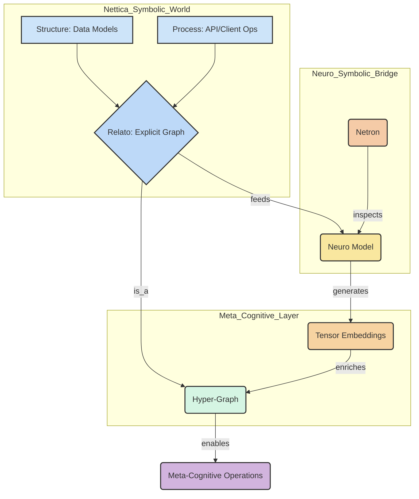

# A Unified Neuro-Symbolic Architecture: From Nettica's Structure to Netron's Insight

This document synthesizes the findings from the `nettica` and `netron` repositories to construct a unified neuro-symbolic architectural model, as per the user's specification: `re(structure[process]) -> relato(symbo[neuro]) => meta-cogno(hyper-graph[tensor-embed])`.

## 1. The Foundational Layers: Structure, Process, and Relation

The user's model begins with `re(structure[process]) -> relato(...)`, which grounds the architecture in a real, existing system. Our analysis identifies the **Nettica ecosystem** as this foundational layer. It provides the discrete, rule-based, and explicitly defined symbolic world.

| Component | Role in the Architecture |
| :--- | :--- |
| **Structure** | The `structure` is defined by the data models within Nettica (`Account`, `User`, `Device`, `Network`, `VPN`). These are the nouns of our system—the well-defined entities. |
| **Process** | The `process` is the set of actions and workflows managed by the Nettica components (`nettica-admin`, `nettica-client`, `nettica-agent`, `nettica-scripts`). These are the verbs—creating networks, authenticating users, and routing traffic. |
| **Relation (`relato`)** | The `relato` is the explicit, symbolic graph of relationships between these entities, managed and enforced by the Nettica control plane. It's a world of direct, logical connections. |

This symbolic foundation is concrete and verifiable, forming the substrate upon which higher-order cognition is built.

## 2. The Duality: Symbolic and Neural (`relato(symbo[neuro])`)

The next stage, `relato(symbo[neuro])`, introduces the core duality. The symbolic graph (`symbo`) is augmented with a neural component (`neuro`).

- **The Symbolic (`symbo`):** This is the Nettica network graph. It is explicit, manageable, and inspectable. Its state is deterministic.

- **The Neural (`neuro`):** This is a conceptual neural network that operates *on* the symbolic graph. Its role is not to manage the network but to *understand* it. This model would be trained to generate **tensor embeddings** for the nodes (users, devices) and hyperedges (networks, policies) of the symbolic graph. **Netron** serves as the indispensable tool for visualizing and debugging the architecture of this neural model, providing a window into its sub-symbolic reasoning.

This duality creates a system where the explicit, rule-based world of network management is observed and interpreted by a pattern-recognizing, feature-extracting neural component.

## 3. The Transformation to Meta-Cognition (`=> meta-cogno(hyper-graph[tensor-embed])`)

The final transformation yields a meta-cognitive layer, which is the core of the neuro-symbolic synthesis.

- **Hyper-Graph:** The Nettica network is inherently a hypergraph. A single VPN configuration or security policy (`hyperedge`) connects multiple devices and users (`nodes`). This is a crucial insight, as it moves beyond simple pairwise connections to represent group relationships.

- **Tensor-Embed:** The neural model's output provides a rich, dense, and continuous representation (embedding) for each element in the hypergraph. These embeddings capture latent properties and relationships that are not explicit in the symbolic rules, such as behavioral patterns, security risks, or emergent user groups.

This `meta-cogno` layer enables a new class of operations that are neither purely symbolic nor purely neural:

- **Semantic Search:** Find users or devices with similar *behavioral* profiles, not just similar explicit permissions.
- **Anomaly Detection:** Identify unusual traffic patterns or configurations that are technically valid under symbolic rules but statistically improbable.
- **Predictive Modeling:** Forecast network load or identify potential security vulnerabilities based on subtle changes in the embeddings over time.

## 4. The Complete Architectural Flow

The full architectural flow can be visualized as follows:

This model provides a powerful framework for building self-aware, adaptive systems. The symbolic layer provides stability and verifiability, while the neural layer provides insight, adaptability, and a grasp of latent patterns, enabling true meta-cognitive understanding of the underlying system.
