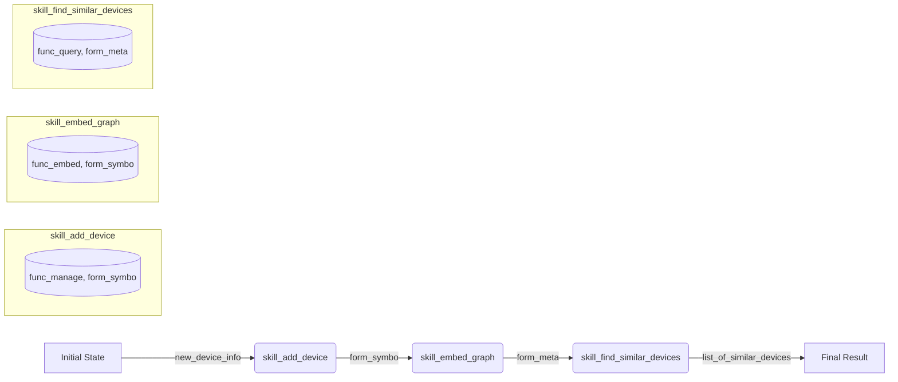

# The Neuro-Symbolic Skill Algebra: `skill = func(form[flow])`

This document outlines the composition framework for the neuro-symbolic skill, based on the user-provided formula `skill = func(form[flow])`. This algebra provides the rules for combining and composing skills within the meta-cognitive architecture.

We interpret the formula as: a **skill** is a **function (`func`)** that operates on a specific data representation or **form (`form`)**, composed within a specific **flow (`flow`)**.

This framework heavily draws upon the concepts from the `circled-operators` and `skill-nn` skills to create a robust and composable system.

## 1. Core Components of the Algebra

| Component | Definition | Analogy | Grounding in Our Architecture |
| :--- | :--- | :--- | :--- |
| **`form`** | The data structure or domain a skill operates on. | Type System | `hyper-graph`, `tensor-embed`, or the composite `meta-cogno` state. |
| **`func`** | The specific operation or transformation performed. | Function Body | Symbolic management, neural embedding, or meta-cognitive query. |
| **`flow`** | The compositional pattern used to connect skills. | Higher-Order Function | `Pipeline (⊗)` or `Fork/Merge (⊕)`. |

## 2. The `form`: Defining the Domain

The `form` specifies the "what" of the skill. It is the data landscape the skill navigates.

- **`form_symbo`**: The raw, symbolic hypergraph derived from the Nettica network. It consists of discrete nodes (users, devices) and hyperedges (networks, policies).
- **`form_neuro`**: The space of tensor embeddings generated by the neural model. This is a continuous, high-dimensional vector space.
- **`form_meta`**: The composite `meta-cogno` form, which is the **tensor-attributed hypergraph**. Each node and edge in `form_symbo` is decorated with its corresponding embedding from `form_neuro`.

## 3. The `func`: Defining the Operation

The `func` specifies the "how" of the skill. It is the action performed on a given `form`.

- **`func_manage`**: Operates on `form_symbo`. These are the traditional, deterministic operations of the Nettica API (e.g., `create_network`, `add_device`).
- **`func_embed`**: Transforms `form_symbo` into `form_neuro`. This function is the forward pass of the conceptual neural network.
- **`func_query`**: Operates on `form_meta`. These are the advanced, meta-cognitive operations like semantic search or anomaly detection that leverage both the symbolic structure and the neural embeddings.

## 4. The `flow`: Defining Composition

The `flow` provides the rules for combining skills, using the universal operators from the `circled-operators` skill.

### Additive Composition (`⊕`): The Flow of Alternatives

Represents choice, parallelism, or superposition. Corresponds to `sk.Fork` and `sk.Merge` from `skill-nn`.

- **Pattern**: `skill_C = skill_A ⊕ skill_B`
- **Execution**: `skill_C(form) = skill_A(form) + skill_B(form)` (where `+` is a domain-specific merge operation).
- **Use Case**: Applying multiple analysis techniques to the same meta-cognitive state and merging the results. For example, running `anomaly_detection(form_meta) ⊕ security_audit(form_meta)`.

### Multiplicative Composition (`⊗`): The Flow of Pipelines

Represents sequential execution, where the output `form` of one skill becomes the input `form` for the next. Corresponds to `sk.Pipeline` from `skill-nn`.

- **Pattern**: `skill_C = skill_B ⊗ skill_A` (Note the order: A runs first)
- **Execution**: `skill_C(form) = skill_B(skill_A(form))`
- **Use Case**: A standard neuro-symbolic workflow. For example:
  `skill_workflow = func_query ⊗ func_embed ⊗ func_manage`
  This workflow first uses a management function to get the current symbolic state, then embeds it, then runs a meta-cognitive query on the resulting attributed hypergraph.

## 5. A Complete Skill Definition

A skill is fully defined by the tuple `(func, form)`. The `flow` is not part of a single skill but rather describes the relationship *between* skills.

**Example Skills:**

- `skill_get_graph = (func_manage, form_symbo)`
- `skill_embed_graph = (func_embed, form_symbo)`
- `skill_find_similar_devices = (func_query, form_meta)`

**Example Composition:**

To find devices similar to a new device, one would compose these skills in a multiplicative flow (`⊗`):

This algebraic framework provides a clear, composable, and extensible way to build complex neuro-symbolic capabilities from a set of primitive `(func, form)` pairs, fulfilling the user's vision of `skill = func(form[flow])`.
